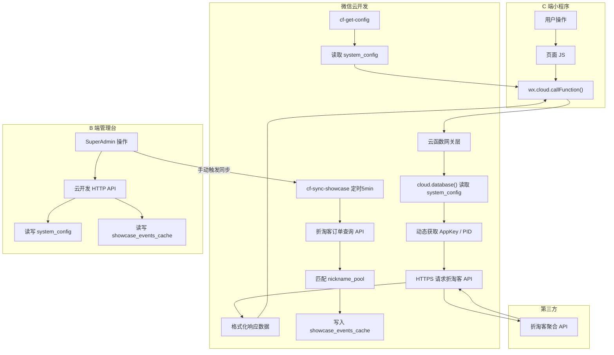

# 🏗️ 小栗鼠 LWQX 3.0 — 技术架构蓝图

| 字段 | 内容 |
| :--- | :--- |
| **文档版本** | v1.2（CSS 规范补充版） |
| **更新日期** | 2026-04-24 |
| **主导角色** | 🏗️ Architect Agent |
| **关联文档** | [立项书](./小栗鼠全案商业与产品立项书.md) · [PRD 总纲](./PRD/PRD-总纲目录.md) · [团队定义](./团队角色定位.md) |

---

## 一、项目目录结构 (Project Tree)

```
XLS/                                    ← 项目根目录
├── Documents/                          ← 产品文档（立项书、PRD、蓝图等）
├── miniprogram/                        ← C 端微信小程序
│   ├── app.js                          ← 全局入口（onLaunch 剪贴板探针）
│   ├── app.json                        ← 页面路由 + TabBar 配置
│   ├── app.wxss                        ← 全局样式（品牌色变量等）
│   ├── components/                     ← 全局复用组件
│   │   ├── product-card/               ← 商品卡片（可配置属性见下方说明）
│   │   ├── bulletin-bar/               ← 实时弹幕/提示条组件
│   │   ├── search-bar/                 ← 搜索框组件
│   │   ├── poster-generator/           ← Canvas 海报生成器
│   │   └── loading-skeleton/           ← 骨架屏组件
│   ├── pages/
│   │   ├── index/                      ← Tab1 查券（PRD-01）
│   │   ├── discover/                   ← Tab2 发现（PRD-03）
│   │   ├── rankings/                   ← Tab3 热榜（PRD-04）
│   │   ├── community/                  ← Tab4 晒单（PRD-05）
│   │   ├── mine/                       ← Tab5 我的（PRD-06）
│   │   ├── detail/                     ← 商品详情页（PRD-02，新增）
│   │   ├── search-result/              ← 搜索结果页（PRD-01/03 共用）
│   │   ├── category-list/              ← 金刚入口子页面
│   │   ├── faq/                        ← 常见问题
│   │   └── guide/                      ← 新手引导
│   ├── utils/
│   │   ├── api.js                      ← wx.cloud.callFunction 封装
│   │   ├── clipboard.js                ← 剪贴板探针逻辑
│   │   ├── storage.js                  ← 本地足迹存储
│   │   └── constants.js                ← 全局常量（颜色、错误码等）
│   └── images/                         ← 静态资源（TabBar 图标等）
│
├── cloudfunctions/                     ← 微信云函数（PRD-07）
│   ├── cf-coupon-search/               ← 查券搜索代理 (REQ-0701)
│   ├── cf-convert-link/                ← 高佣转链代理 (REQ-0702)
│   ├── cf-feed-data/                   ← 榜单/信息流代理 (REQ-0703)
│   ├── cf-get-config/                  ← 全局配置读取 (REQ-0704)
│   ├── cf-product-detail/              ← 商品详情代理 (新增)
│   ├── cf-sync-showcase/               ← 晒单缓存同步 (定时触发)
│   └── cf-sync-orders/                 ← 订单大盘同步 (定时触发)
│
├── admin/                              ← B 端管理后台（PRD-08）
│   ├── src/
│   │   ├── pages/
│   │   │   ├── config-center/          ← API 参数集控中心
│   │   │   ├── nickname-pool/          ← 昵称池管理
│   │   │   ├── showcase-cache/         ← 晒单缓存管理（同步监控/手动触发/过期清理）
│   │   │   ├── seed-bulletin/          ← 种子弹幕管理
│   │   │   └── dashboard/              ← 数据看板（Phase 1.5）
│   │   ├── components/                 ← 通用 UI 组件
│   │   ├── services/                   ← 云数据库 HTTP API 封装
│   │   └── App.tsx                     ← 应用入口
│   └── package.json                    ← Vite + React 18 + TailwindCSS 4
│
└── project.config.json                 ← 微信开发者工具配置
```

> ⚠️ **旧云函数说明**：现有 `cloudfunctions/` 中的 14 个旧函数（如 `parse_and_convert`、`get_user_assets` 等）为 2.0 版本遗留，Phase 1.0 中**不删除但不使用**，新函数使用 `cf-` 前缀命名以区分。

### product-card 组件可配置属性

| 属性 | 类型 | 默认值 | 说明 | 使用页面 |
| :--- | :---: | :---: | :--- | :--- |
| `showPlatformTag` | Boolean | `true` | 平台来源 Tag（淘宝/京东） | 全局（PRD-02/03/04/05） |
| `showSavedAmount` | Boolean | `false` | "省XX元"红色 Tag | 仅晒单页（PRD-05 REQ-0501） |
| `showRankBadge` | Boolean | `false` | Top N 名次金冠角标 | 仅榜单页（PRD-04 REQ-0402） |
| `showNickname` | Boolean | `false` | 脱敏昵称 + "刚刚下单" | 仅晒单页（PRD-05 REQ-0501） |

---

## 二、系统数据流 (Data Flow)



---

## 三、云函数接口契约 (API Contracts)

### 3.1 cf-coupon-search（查券搜索代理）

| 字段 | 说明 |
| :--- | :--- |
| **对应 PRD** | PRD-07 REQ-0701 |
| **触发方式** | `wx.cloud.callFunction` |

**入参：**
```json
{
  "query": "string (淘口令/关键词/商品链接)",
  "query_type": "enum: 'tkl' | 'keyword' | 'url'",
  "platform": "enum: 'taobao' | 'jd' | 'auto'",
  "page": "number (默认 1)",
  "page_size": "number (默认 20)"
}
```

**出参（成功）：**
```json
{
  "code": 0,
  "data": {
    "items": [
      {
        "tao_id": "string",
        "title": "string",
        "image_url": "string",
        "original_price": "number",
        "coupon_amount": "number",
        "coupon_price": "number",
        "platform": "enum: 'taobao' | 'jd'",
        "shop_name": "string",
        "sales_num": "number"
      }
    ],
    "total": "number",
    "page": "number"
  }
}
```

**出参（失败）：**
```json
{
  "code": -1,
  "message": "string (用户友好文案，不暴露技术细节)"
}
```

**错误码表：**

| code | message | 原因 |
| :---: | :--- | :--- |
| 0 | (成功) | — |
| -1 | 系统维护中，请稍后重试 | AppKey 无效/过期 |
| -2 | 查询超时，请重试 | API 响应 >5s |
| -3 | 未找到相关商品 | 搜索无结果 |

---

### 3.2 cf-convert-link（高佣转链代理）

| 字段 | 说明 |
| :--- | :--- |
| **对应 PRD** | PRD-07 REQ-0702 |

**入参：**
```json
{
  "tao_id": "string (商品 ID)",
  "platform": "enum: 'taobao' | 'jd'"
}
```

**出参（成功）：**
```json
{
  "code": 0,
  "data": {
    "coupon_click_url": "string (领券链接)",
    "tkl": "string (淘口令，仅淘宝)",
    "short_url": "string (短链，仅京东)",
    "coupon_price": "number",
    "original_price": "number"
  }
}
```

---

### 3.3 cf-feed-data（榜单/信息流代理）

| 字段 | 说明 |
| :--- | :--- |
| **对应 PRD** | PRD-07 REQ-0703 |

**入参：**
```json
{
  "feed_type": "enum: 'hot_2h' | 'realtime' | 'all_day' | 'monthly' | 'pyq' | 'jd_self' | 'jd_good_store' | 'jd_pingou' | 'jd_delivery' | 'coupon_hall' | 'cheap_99' | 'cheap_199' | 'juhuasuan' | 'brand'",
  "platform": "enum: 'taobao' | 'jd' | 'both'",
  "page": "number",
  "page_size": "number",
  "cid": "string (分类 ID, 可选)"
}
```

**出参：** 同 `cf-coupon-search` 的 `data.items` 格式。

**feed_type 与折淘客 API 映射表：**

| feed_type | 淘宝端口 (10001) | 京东端口 (20000) |
| :--- | :--- | :--- |
| `hot_2h` | `api_xiaoshi.ashx` (#17) | `api_xiaoshi.ashx` (#18) |
| `realtime` | `api_shishi.ashx` (#25) | `api_shishi.ashx` (#32) |
| `all_day` | `api_quantian.ashx` (#24) | `api_quantian.ashx` (#31) |
| `monthly` | `api_quantian.ashx` (#24) | `api_quantian.ashx` (#31) |
| `pyq` | `api_all.ashx?tag=1` (#20) | `api_all.ashx?tag=1` (#27) |
| `jd_self` | — | `api_all.ashx?tj=tmall` (#8) ⚠️ 京东端口复用淘宝参数命名 |
| `jd_good_store` | — | `api_all.ashx?tj=gold_seller` (#9) ⚠️ 同上 |
| `jd_pingou` | — | `api_all.ashx?jt=taoqianggou` (#10) ⚠️ 同上 |
| `jd_delivery` | — | `api_all.ashx?jt=juhuasuan` (#14) ⚠️ 同上 |
| `coupon_hall` | `api_all.ashx` (#15) | `api_all.ashx` (#16) |
| `cheap_99` | `api_all.ashx?price=0-9.9` (#33) | `api_all.ashx?price=0-9.9` (#34) |
| `cheap_199` | `api_all.ashx?price=0-19.9` (#35) | `api_all.ashx?price=0-19.9` (#36) |
| `juhuasuan` | `api_all.ashx?jt=juhuasuan` (#13) | `api_all.ashx?jt=juhuasuan` (#14) |
| `brand` | `api_all.ashx?pinpai=1` (#11) | `api_all.ashx?pinpai=1` (#12) |

---

### 3.4 cf-get-config（全局配置读取）

**入参：** 无（或 `{ keys: ['theme_color', 'nickname_pool'] }` 按需读取）

**出参：**
```json
{
  "code": 0,
  "data": {
    "ztk_appkey": "string (仅云函数内部使用，不返回前端)",
    "taobao_pid": "string (仅云函数内部使用)",
    "theme_color": "#FF5500",
    "nickname_pool": ["省钱达人", "用户*8848", "..."],
    "service_qrcode_url": "string",
    "announcement": { "enabled": false, "title": "", "content": "" }
  }
}
```

> 🔴 **安全约束**：`ztk_appkey`、`taobao_pid`、`jd_appkey`、`jd_secret` **严禁返回给前端**。`cf-get-config` 返回给前端时必须过滤敏感字段。

---

### 3.5 cf-sync-showcase（晒单缓存同步 · 定时触发）

| 字段 | 说明 |
| :--- | :--- |
| **对应 PRD** | PRD-07 §7.6.4 |
| **触发方式** | 定时触发器（每 5 分钟） |

**执行逻辑：**
1. 调用折淘客订单查询接口 `open_dingdanchaxun2`，获取最近 10 分钟新成交订单。
2. 从 `system_config.nickname_pool` 随机抽取脱敏昵称。
3. 组装为 `showcase_events_cache` 记录并写入。
4. 清理 `event_timestamp` 超过 48 小时的过期记录。

---

## 四、数据库 Collection Schema 总表

| 集合名称 | 用途 | 定义位置 |
| :--- | :--- | :--- |
| `system_config` | 全局配置（AppKey/PID/主题色/昵称池/公告） | PRD-07 §7.6.1 |
| `bulletin_logs` | 弹幕事件日志（真实 + 种子） | PRD-07 §7.6.2 |
| `featured_orders` | 精选商品（B 端手工录入，保留备用） | PRD-07 §7.6.3 |
| `showcase_events_cache` | 实时晒单缓存表（48h 生命周期） | PRD-07 §7.6.4 |
| `tk_orders` | 原始订单大盘（定时同步，仅统计用） | PRD-07 §7.5 |

---

## 五、C 端页面路由表

| 路由 | 页面 | 对应 PRD | Tab |
| :--- | :--- | :--- | :---: |
| `pages/index/index` | 查券首页 | PRD-01 | Tab1 |
| `pages/discover/discover` | 发现 | PRD-03 | Tab2 |
| `pages/rankings/rankings` | 热榜 | PRD-04 | Tab3 |
| `pages/community/community` | 晒单 | PRD-05 | Tab4 |
| `pages/mine/mine` | 我的 | PRD-06 | Tab5 |
| `pages/detail/detail` | 商品详情 | PRD-02 | — |
| `pages/search-result/search-result` | 搜索结果 | PRD-01/03 | — |
| `pages/category-list/category-list` | 金刚入口子页 | PRD-03 | — |
| `pages/faq/faq` | 常见问题 | PRD-06 | — |
| `pages/guide/guide` | 新手引导 | PRD-01 | — |

---

## 六、云函数编码规范 (Cloud Engineer 必读)

### 6.1 目录结构约定

每个云函数目录结构统一为：
```
cf-coupon-search/
├── index.js          ← 入口文件（exports.main）
├── package.json      ← 依赖声明（仅 wx-server-sdk）
└── config.json       ← 云函数配置（超时时间、内存等）
```

### 6.2 入口模板

```javascript
const cloud = require('wx-server-sdk')
cloud.init({ env: cloud.DYNAMIC_CURRENT_ENV })
const db = cloud.database()

exports.main = async (event, context) => {
  try {
    // 1. 入参校验
    const { query, query_type, platform = 'auto', page = 1, page_size = 20 } = event
    if (!query) return { code: -1, message: '请输入搜索内容' }

    // 2. 动态读取配置（严禁硬编码）
    const configRes = await db.collection('system_config').doc('global').get()
    const { ztk_appkey, taobao_pid } = configRes.data

    // 3. 调用折淘客 API
    // ...

    // 4. 返回标准格式
    return { code: 0, data: { items: [], total: 0, page } }
  } catch (err) {
    console.error('[cf-coupon-search] Error:', err)
    return { code: -1, message: '系统维护中，请稍后重试' }
  }
}
```

### 6.3 铁律

1. **所有 AppKey/PID 从 `system_config` 动态读取**，严禁 `const APPKEY = 'xxx'`。
2. **错误信息脱敏**：`catch` 中日志记录原始错误，返回给前端的 message 必须是用户友好文案。
3. **超时设置**：`config.json` 中 `timeout` 默认 10 秒，最大不超过 20 秒。
4. **缓存策略**：对同一请求（query + query_type + platform）3 分钟内的重复调用，优先返回内存缓存。
5. **日志规范**：所有 `console.error` / `console.log` 必须包含函数名前缀（如 `[cf-coupon-search]`），便于在云开发控制台按函数名筛选。

---

## 七、小程序组件编码规范 (MiniApp Engineer 必读)

### 7.1 组件命名

- 全局组件放 `components/` 目录，使用 kebab-case 命名（如 `product-card`）。
- 页面私有组件放对应页面目录下的 `components/` 子目录。

### 7.2 云函数调用封装

所有云函数调用统一通过 `utils/api.js` 封装，禁止页面直接写 `wx.cloud.callFunction`：

```javascript
// utils/api.js
const callCloud = async (name, data = {}) => {
  try {
    const res = await wx.cloud.callFunction({ name, data })
    if (res.result.code !== 0) {
      wx.showToast({ title: res.result.message, icon: 'none' })
      return null
    }
    return res.result.data
  } catch (err) {
    wx.showToast({ title: '网络异常，请重试', icon: 'none' })
    return null
  }
}

module.exports = {
  searchCoupon: (params) => callCloud('cf-coupon-search', params),
  convertLink: (params) => callCloud('cf-convert-link', params),
  getFeedData: (params) => callCloud('cf-feed-data', params),
  getConfig: (keys) => callCloud('cf-get-config', { keys }),
  getProductDetail: (tao_id, platform) => callCloud('cf-product-detail', { tao_id, platform }),
}
```

### 7.3 品牌色与样式变量

```css
/* app.wxss 全局变量 */
page {
  --brand-primary: #FF5500;    /* 栗橙主色 */
  --brand-danger: #FF2D2D;     /* 警示红 */
  --bg-global: #F8F9FA;        /* 全局底色 */
  --text-primary: #1A1A1A;     /* 文字主色 */
  --text-secondary: #999999;   /* 文字辅色 */
  --tag-bg: #F5F5F5;           /* 平台 Tag 背景 */
  --tag-text: #666666;         /* 平台 Tag 文字 */
}
```

### 7.4 平台 Tag 组件规范

所有页面的商品卡片必须使用统一的平台 Tag 样式：
- 背景：`var(--tag-bg)` (#F5F5F5)
- 文字：`var(--tag-text)` (#666)
- 圆角：4px
- 字号：10px / 20rpx
- 内边距：2px 6px

### 7.5 剪贴板探针防抖

```javascript
// utils/clipboard.js - 每 Session 仅触发一次
// ⚠️ 使用 App 全局变量而非 Storage，确保冷启动后自动重置
const checkClipboard = async () => {
  const app = getApp()
  if (app.clipboardChecked) return null // 本次 Session 已触发
  try {
    const res = await wx.getClipboardData()
    const text = res.data || ''
    // 检测淘口令或京东链接
    const isTkl = /￥.+￥/.test(text) || /\$[a-zA-Z0-9]+\$/.test(text)
    const isJdUrl = /jd\.com|m\.jd\.com/.test(text)
    if (isTkl || isJdUrl) {
      app.clipboardChecked = true // 全局变量，Session 结束自动销毁
      return { text, type: isTkl ? 'tkl' : 'url', platform: isTkl ? 'taobao' : 'jd' }
    }
    return null
  } catch { return null }
}
```

---

### 7.6 CSS 样式方案（全体前端工程师必读 ⚠️）

> 🔴 **铁律：小程序端不使用 Tailwind CSS 编译器。`app.wxss` 是一份手写的有限工具类集合。**

#### 7.6.1 方案说明

`app.wxss` 中提供了一套仿 Tailwind 命名风格的原子工具类（如 `.flex`、`.text-sm`、`.rounded-xl`、`.bg-white` 等），但这些类是**逐条手写**的，并非由 Tailwind 编译器自动生成。因此：

| ❌ 禁止写法（不会被渲染） | ✅ 正确写法 |
| :--- | :--- |
| `text-[28rpx]`（方括号任意值） | 使用已定义的类 `text-sm`，或在页面级 `.wxss` 中手写 |
| `bg-[#FF9B7F]`（方括号颜色） | 在页面级 `.wxss` 中定义具体 class |
| `border-2 border-[#FF5500]`（未定义的 border 工具类） | 在页面级 `.wxss` 中手写 `border: 3rpx solid #FF5500` |
| `w-[200rpx]`、`h-[80rpx]`（方括号尺寸） | 在页面级 `.wxss` 中手写 `width: 200rpx` |
| `leading-relaxed`、`truncate`（未定义的工具类） | 在页面级 `.wxss` 中手写对应属性 |
| `rounded-2xl`、`rounded-3xl`（未定义的圆角等级） | 使用已有的 `rounded-xl`(24rpx) 或 `rounded-full`，或手写 |

#### 7.6.2 已定义的可用工具类清单

以下类已在 `app.wxss` 中定义，可在任何页面的 `.wxml` 中**直接使用**：

**布局**：`flex`、`flex-col`、`flex-row`、`items-center`、`items-end`、`justify-center`、`justify-between`、`justify-end`、`flex-1`、`flex-shrink-0`、`gap-1/2/3/4`、`w-full`、`h-full`

**文字大小**：`text-xs`(24rpx)、`text-sm`(28rpx)、`text-base`(32rpx)、`text-lg`(36rpx)、`text-xl`(40rpx)、`text-2xl`(48rpx)、`text-4xl`(72rpx)、`text-6xl`(96rpx)

**文字颜色**：`text-white`、`text-gray-400`、`text-gray-500`、`text-gray-600`、`text-gray-700`、`text-gray-900`、`text-brand`

**字重**：`font-normal`(400)、`font-medium`(500)、`font-bold`(700)、`font-black`(900)

**背景色**：`bg-white`、`bg-brand`、`bg-gray-50`、`bg-gray-100`、`bg-gray-200`、`bg-orange-50`、`bg-blue-50`、`bg-green-50`

**圆角**：`rounded-sm`(4rpx)、`rounded-md`(8rpx)、`rounded-lg`(16rpx)、`rounded-xl`(24rpx)、`rounded-full`(9999rpx)

**阴影**：`shadow-sm`、`shadow-md`

**定位**：`relative`、`absolute`、`sticky`、`overflow-hidden`、`z-50`

**截断**：`line-clamp-1`、`line-clamp-2`

**间距**：`px-3`、`px-4`、`px-6`、`py-2`、`py-3`、`py-4`、`py-20`、`p-4`、`p-6`、`pt-6`、`pt-10`、`pb-2`、`mr-2`、`mt-4`、`mt-8`、`mb-2`、`mb-3`、`mb-4`、`mb-6`、`mb-8`、`mb-10`

**其他**：`border`、`border-b`、`border-gray-100`、`border-gray-200`、`pb-safe`、`text-center`、`text-left`、`line-through`、`break-all`、`w-8`、`h-8`、`h-1`

#### 7.6.3 编码原则

1. **优先使用已有工具类**：在 `.wxml` 的 `class` 中使用上述清单里的类名进行布局和排版。
2. **特有样式写进页面级 `.wxss`**：颜色、尺寸等需要精确控制的样式，必须在对应页面的 `.wxss` 文件中以具名 class 方式定义（如 `.search-btn { ... }`）。
3. **禁止使用方括号语法**：任何 `class="xxx-[value]"` 的写法在本项目中**100% 无效**，必须杜绝。
4. **新增全局工具类需审批**：如需在 `app.wxss` 中新增工具类，必须经 SuperAdmin 审批后统一添加，避免冲突。
5. **Admin 管理台例外**：`admin/` 目录使用 Vite + TailwindCSS 4 编译器，方括号语法在管理台中可正常使用，此限制仅适用于小程序端。

---

## 八、文档状态

| 状态 | 日期 | 操作人 |
| :--- | :--- | :--- |
| v1.0 初版输出 | 2026-04-21 | Architect Agent |
| ✅ v1.1 团队评审修正（7 项修复） | 2026-04-21 | 全体 Agent + SuperAdmin 审批 |
| **✅ v1.2 新增 §7.6 CSS 样式方案铁律（修复方括号语法全面失效问题）** | **2026-04-24** | **Frontend Engineer Agent + SuperAdmin 审批** |

> 📌 本蓝图已通过团队评审并经 SuperAdmin 审批生效，即作为全体工程师 Agent 的"施工图纸"。后续任务拆解将直接引用本文档的接口契约和目录结构。
